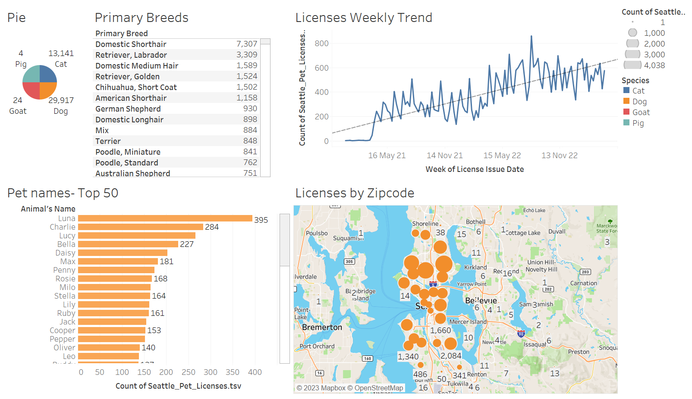

# SQL Analysis and Visualization: Seattle Pet Licenses

## Overview: 
This repository contains the code and documentation for my academic project, where I conducted SQL analysis and visualization of the Seattle Pet Licenses dataset. The project aimed to explore and derive meaningful insights from the dataset using tools such as **Alteryx** for data preparation and profiling, **Tableau** for data visualization, and **MySQL** for database management.

## About the dataset:
The dataset used is Seattle Pet Licenses, which is provided by the City of Seattle. This dataset is a reflection of Seattle's commitment to responsible pet ownership and community welfare. Its a comprehensive collection of information that provides valuable insights into the city's pet population.

It contains a list of active or current Seattle pet licenses from October 2015 to April 2023, including animal type (species), pet's name, breed (primary and secondary), license issue date, license number, and the owner's ZIP code.

## Project Motivation and Goal:
In an effort to enhance public safety, promote animal welfare, and maintain a healthy environment, the City of Seattle requires pet owners to obtain licenses for their furry companions. By analyzing the Seattle Pet Licenses dataset, researchers, policymakers, and the general public can gain a deeper understanding of the distribution and demographics of pets within the city. This information is instrumental in shaping policies, implementing targeted outreach programs, and fostering a sense of community responsibility towards our four-legged friends.

Whether you're interested in tracking trends in pet ownership, analyzing the prevalence of specific breeds, or understanding the geographical distribution of licensed pets, this project serves as a valuable resource. It is a testament to Seattle's proactive approach to fostering a harmonious coexistence between residents and their beloved pets. From the bustling urban areas to the serene neighborhoods, each data point contributes to a broader narrative of responsible pet ownership and the shared bond between Seattleites and their animal companions. 

## Let's delve into the Seattle Pet Licenses dataset to discover the stories it tells about the city's vibrant and diverse pet community!

### Project Structure

The project is organized into the following directories and files:
- Alteryx: This directory includes the workflows and scripts used for data preparation and profiling using Alteryx.
- Tableau: Holds the Tableau workbook and related files used for visualization.
- MySQL: Contains the SQL scripts used to create and manage the MySQL database, as well as the queries for analysis.

### SQL Queries

MySQL query file provides a comprehensive set of analyses and transformations applied to the Seattle Pet Licenses dataset. Let's break down each section:

1. Retrieve Information: The first query retrieves all information from the dataset.
2. Filter by License Number: Retrieves all information for a specific pet license number, in this case, 'S140122'.
3. Filter by License Issue Date: Retrieves all pet licenses issued on 'May 19, 2020'.
4. Filter by ZIP Code: Retrieves pet licenses issued in a specific ZIP code area ('98112').
5. Date-related Transformations: Extracts various date-related columns from the "LicenseIssueDateFormatted" column.
6. License Issue Dates Statistics: Provides the earliest issue date, the latest issue date, and the range of license issue dates.
7. Species Analysis: Lists unique species, provides the total number of licenses for each species, and calculates the percentage of licenses for each species.
8. Yearly Analysis: Analyzes the total number of licenses issued in each year and identifies the top years with the highest number of licenses.
9. Monthly and Daily Analysis: Identifies the top months, days, and specific dates with the highest number of license issuances.
10. Animal Name Analysis: Lists unique animal names, provides the total number of licenses for each animal name, and identifies the top animal names.
11. Animal Name Transformations: Converts animal names to uppercase and lowercase, finds the length of the animal name string, and concatenates animal names with species.
12. Breed Analysis: Lists unique primary and secondary breeds, provides the total number of licenses for each breed, and identifies the top breeds.
13. Secondary Breed Analysis: Counts the pet licenses that have a specified secondary breed and provides a breakdown by species.
14. ZIP Code Analysis: Lists unique ZIP codes, provides the total number of licenses for each ZIP code, and identifies the top ZIP codes.
15. Multibreed Analysis: Identifies details of pets with the same name but different breeds and pets with the same name but different species.
16. Days Licensed Issued: Computes the days since the license was issued. 
17. Percentage Analysis: Calculates the percentage of licenses issued for each species compared to the total number of licenses, both using subqueries and window functions.
18. Breed Combination Analysis: Counts the number of licenses issued for each breed, including both primary and secondary breeds.
    
These queries provide a thorough exploration of the Seattle Pet Licenses dataset, covering a wide range of analyses and transformations to gain insights into pet ownership patterns in the city.

### Visualizations 
 

	  
    <em>Tableau Dashboard</em>

